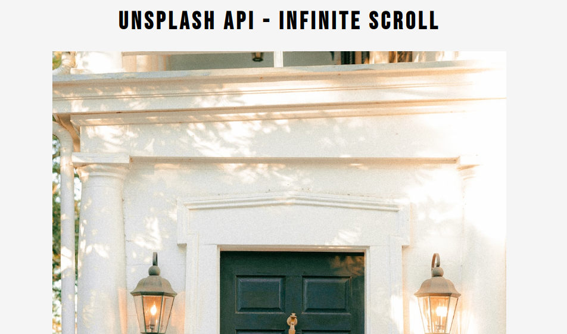

# react_Infinite Scroll: [LIVE DEMO](https://shcoobz.github.io/react_infinite-scroll/)

## Summary

react_Infinite Scroll provides a seamless browsing experience by fetching and displaying a continuous flow of images from the Unsplash API. It features a user-friendly interface that allows users to endlessly scroll through high-quality photos without manual page refreshes.

The core functionality includes:

- Infinite scrolling to continuously load images as the user scrolls
- Lightweight and responsive design suitable for various devices
- Direct links to high-resolution images hosted on Unsplash

## Features

### Infinite Scrolling

This feature allows users to scroll through an endless list of images loaded dynamically as they reach the bottom of the page, enhancing user engagement and time spent on the app.

### Responsive Image Grid

The responsive image grid adjusts the number of images displayed based on the screen size, ensuring optimal layout across devices from desktops to smartphones.

### Error Handling

Implements robust error handling to manage and report any issues with network requests or data parsing, ensuring the application remains functional and responsive under various conditions.

### Additional Features

- Placeholder loading animations during image fetch operations.
- Accessibility features such as keyboard navigation and ARIA attributes.

## Technologies

- **React:** Used to build the entire frontend with hooks for state management and effects.
- **Unsplash API:** Provides access to a massive library of high-quality images.
- **Intersection Observer API:** Enables the infinite scroll functionality by detecting when the user approaches the bottom of the page.

---

_Note: This document provides an overview of react_Infinite Scroll. For detailed instructions and more information, please refer to the source code documentation._

_This project is a conversion from an earlier version built with vanilla JavaScript and HTML, available [here](https://github.com/Shcoobz/basicJS_infinite-scroll/). This conversion integrates React to enhance UI reactivity and maintainability._
